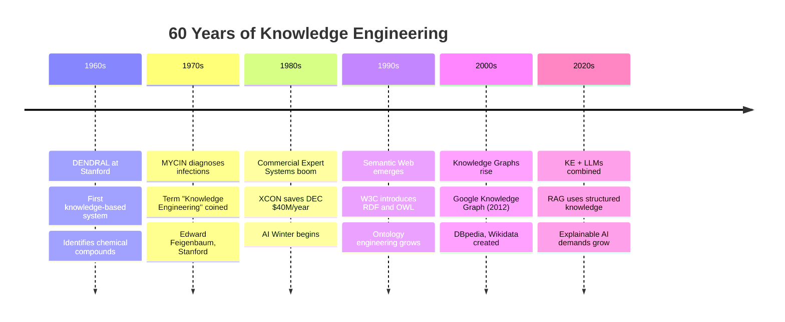

# Module 1.1 — What is Knowledge Engineering?

---

## Opening Hook

!!! quote "The Problem KE Was Born to Solve"
    A hospital's most experienced diagnostic specialist retires after 30 years.
    She takes with her an irreplaceable understanding of rare disease patterns,
    subtle clinical indicators, and hard-won diagnostic intuition.

    **What if that expertise didn't have to leave with her?**

    That is the exact problem Knowledge Engineering was born to solve.

---

## Formal Definition

> **Knowledge Engineering (KE)** is the discipline of building computer systems that capture, represent, and apply human expertise to solve complex problems — in a way that is accurate, explainable, and maintainable.

| Word | Meaning |
|---|---|
| **Capture** | Extract expertise from human minds and documents |
| **Represent** | Give that knowledge a structure a computer can process |
| **Apply** | Use that knowledge to reason, decide, and solve problems |
| **Explainable** | The system can tell you *WHY* it reached a conclusion |
| **Maintainable** | Knowledge can be updated as the domain evolves |

!!! info "Key Insight"
    Knowledge Engineers are **translators** — they take the implicit knowledge that lives in experts' minds and transform it into explicit, structured formats that machines can process and act upon.

---

## The Simple Analogy

Think of KE as writing an instruction manual for a robot — but not just any manual. One that captures not just **WHAT** to do, but **WHY** to do it, and **WHEN** to do it differently.

| Grandma Says | KE Translates To |
|---|---|
| "Add a pinch of love" | `IF taste_test = "bland" THEN add_salt(5g)` |
| "Bake until it looks right" | `IF color = "golden-brown" THEN bake_time_complete` |
| "It needs more time" | `IF internal_temp < 75°C THEN extend_bake(5_mins)` |

Regular programming says: *"If temperature > 100, shut down."*
Knowledge Engineering says: *"Apply the maintenance expert's 20-year understanding of how this machine behaves under stress."*

---

## History & Evolution of KE

---

## KE vs Other Approaches

=== "vs Traditional Programming"
    | Aspect | Traditional Programming | Knowledge Engineering |
    |---|---|---|
    | **Knowledge Source** | Programmer codes rules explicitly | Domain expert provides rules |
    | **Flexibility** | Low — every case must be coded | Medium — rules generalise |
    | **Explainability** | High | Very High |
    | **Maintenance** | Code changes needed | KB update only |
    | **Best For** | Deterministic, well-defined tasks | Complex domain reasoning |

=== "vs Machine Learning"
    | Aspect | Machine Learning | Knowledge Engineering |
    |---|---|---|
    | **Knowledge Source** | Learned from data | Extracted from domain experts |
    | **Data Required** | Large labelled datasets | Minimal (expert knowledge) |
    | **Explainability** | Low (black box) | Very High (rule traces) |
    | **Accuracy** | Statistical/probabilistic | High within domain |
    | **Best For** | Pattern recognition in data | Reasoning with domain rules |

=== "vs Generative AI"
    | Aspect | Generative AI | Knowledge Engineering |
    |---|---|---|
    | **Knowledge Source** | Massive training corpus | Structured domain expert knowledge |
    | **Flexibility** | Very High | Medium |
    | **Explainability** | Very Low | Very High |
    | **Hallucination Risk** | High | Very Low |
    | **Best For** | Language, creativity, general Q&A | Precise domain decisions |

!!! success "The Modern Answer: Combine All Three"
    **Gen AI** handles language and flexibility.
    **KE** provides the structured guardrails, facts, and reasoning.
    **ML** learns patterns from data to supplement explicit rules.

    Together they create AI that is **flexible, accurate, and trustworthy**.

---

## Key Takeaways

- [x] KE is the discipline of **capturing and applying human expertise** in computer systems
- [x] It was born from **Expert Systems** in the 1960s at Stanford
- [x] It differs from ML: **KE uses structured rules**; ML learns from data
- [x] It differs from Gen AI: **KE is precise and explainable**; Gen AI is flexible but can hallucinate
- [x] Modern KE **combines with Gen AI** for the best of both worlds

---

## What's Next

[Module 1.2 — Types of Knowledge →](module-1-2.md){ .md-button .md-button--primary }

---

*Ready to test yourself? → [Module 1.1 Quiz](assessment.md#module-11-quiz)*
*Want the slide outline? → [Module 1.1 Slides](slides.md#module-11-slide-outline)*
*Hands-on practice? → [Lab 1.1](labs.md#lab-11)*
