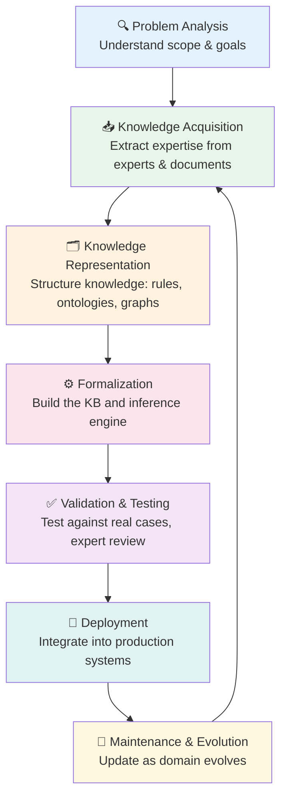
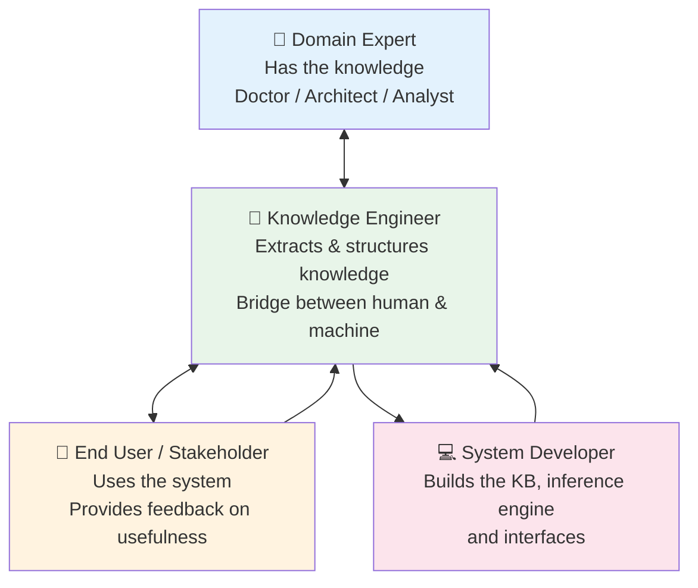

# Module 1.3 — The Knowledge Engineering Lifecycle

---

## Overview

> KE is **not** a one-time activity. It is a continuous cycle of acquiring, structuring, validating, and maintaining knowledge. Treating it as a project with a fixed end date is one of the most common mistakes in KE projects.

---

## The Full Lifecycle



---

## Phase 1 — Problem Analysis

!!! abstract "Goal: Understand the problem before touching any technology"

**What happens in this phase:**

- Define the problem scope — what will the system do and, critically, what it will NOT do
- Identify the domain and sub-domains
- Identify domain experts and knowledge sources
- Define success criteria — how will you know it is working?

**Key questions to answer:**

| Question | Why It Matters |
|---|---|
| What decisions must the system make? | Defines the inference requirements |
| Who are the experts whose knowledge we need? | Determines acquisition strategy |
| How will we measure success? | Prevents scope creep and validates outcomes |
| What are the system boundaries? | Prevents over-engineering |

!!! warning "Most Common Mistake"
    Skipping Problem Analysis and jumping straight to acquisition. This leads to capturing the wrong knowledge and building a system nobody uses.

---

## Phase 2 — Knowledge Acquisition

!!! abstract "Goal: Extract expertise from experts, documents, and data"

**Key activities:**

- Structured and unstructured expert interviews
- Think-aloud protocol sessions
- Document and case analysis
- Resolving conflicts between multiple experts

**Outputs:** Raw knowledge inventory — a documented collection of facts, rules, heuristics, and cases.

> *Covered in depth in Part 2 of this course.*

---

## Phase 3 — Knowledge Representation

!!! abstract "Goal: Give the knowledge a structure machines can process"

**Key decisions:**

- Which representation method suits the domain? (rules, ontology, knowledge graph, or all three?)
- How will uncertainty be handled?
- What does the inference engine need to work with?

**Example rule output from this phase:**

```
Rule R14:
IF   workload_type = "event-driven"
     AND message_volume = "high"
     AND coupling_requirement = "loose"
THEN recommend = "Azure Service Bus"
CONFIDENCE = 0.92
REASON = "Decoupled async messaging for high-throughput event-driven workloads"
```

> *Covered in depth in Part 3 of this course.*

---

## Phase 4 — Formalization

!!! abstract "Goal: Build the working knowledge base and inference engine"

**Key activities:**

- Encode rules, facts, and ontologies into the chosen KB technology
- Build or configure the inference engine
- Connect knowledge base to application layer

**Tools used:** Drools, Apache Jena, Neo4j, custom rule engines, LangChain

---

## Phase 5 — Validation & Testing

!!! abstract "Goal: Verify knowledge is correct, complete, and consistent"

**Three types of validation:**

=== "Completeness Testing"
    Does the system handle all expected scenarios including edge cases?

    *"What happens when the user provides conflicting inputs?"*

=== "Consistency Testing"
    Are there any contradictory rules that fire on the same input?

    *Rule A says recommend X, Rule B says avoid X — both trigger together.*

=== "Accuracy Testing"
    Does the system match expert judgment on known cases?

    *Give it 20 historical cases where the answer is known. How many does it get right?*

---

## Phase 6 — Deployment

!!! abstract "Goal: Integrate the KE system into production workflows"

**Key considerations:**

- API design — how will applications query the KB?
- Explanation interface — how will users see the reasoning?
- Monitoring — how will you detect when the KB gives wrong answers?
- Rollback plan — what if the deployed KB causes issues?

---

## Phase 7 — Maintenance & Evolution

!!! abstract "Goal: Keep knowledge current as the domain changes"

**Why maintenance is often underestimated:**

- Regulations change → compliance rules become outdated
- New technologies emerge → architecture patterns evolve
- Experts retire or change their minds
- New edge cases are discovered in production

**Maintenance questions to establish upfront:**

| Question | Answer |
|---|---|
| Who owns the KB? | Named owner with update authority |
| How often is it reviewed? | Quarterly at minimum |
| How are changes versioned? | Git-based version control |
| What triggers an urgent update? | Production error, regulatory change |

---

## The KE Project Team



!!! tip "The Knowledge Engineer's Role"
    The KE engineer does NOT need to be a domain expert. They need to be a skilled **communicator and analyst** who can draw out expertise from those who have it and translate it into formal knowledge structures.

---

## Key Takeaways

- [x] KE is a **lifecycle, not a one-time task** — maintenance is as important as acquisition
- [x] Always start with **Problem Analysis** — understand scope before touching technology
- [x] **Validation is critical** — expert sign-off on test cases is mandatory
- [x] **Maintenance is often underestimated** — knowledge goes stale without active management
- [x] Success requires collaboration: **Domain Expert + Knowledge Engineer + End User**

---

## What's Next

[Module 1.4 — Expert Systems →](module-1-4.md){ .md-button .md-button--primary }

---

*Ready to test yourself? → [Module 1.3 Quiz](assessment.md#module-13-quiz)*
*Hands-on practice? → [Lab 1.3](labs.md#lab-13)*
