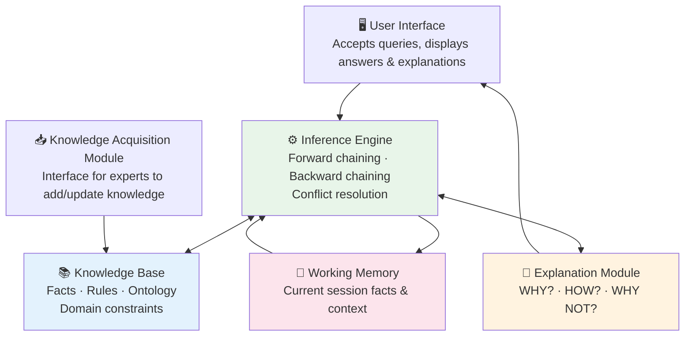

# Module 1.4 — Expert Systems: The Origin of KE

---

## What is an Expert System?

> An **Expert System** is a computer program that mimics the decision-making ability of a human expert in a specific domain. It is the original, most direct application of Knowledge Engineering.

```
Expert System = Knowledge Base + Inference Engine + Explanation Module
```

!!! info "What Makes Expert Systems Special"
    Unlike a database (which stores facts) or an ML model (which predicts from patterns), an Expert System can **reason** about a problem and **explain exactly why** it reached its conclusion — in terms a domain expert would recognise.

---

## Landmark Expert Systems

| System | Year | Institution | Domain | Achievement |
|---|---|---|---|---|
| **DENDRAL** | 1965 | Stanford | Chemistry | First successful KB system — identified molecular structures from mass spectrometry data |
| **MYCIN** | 1974 | Stanford | Medicine | Diagnosed bacterial blood infections at specialist level; pioneered certainty factors |
| **XCON (R1)** | 1980 | DEC / CMU | IT Configuration | Configured VAX computer orders; saved DEC **$40 million/year** |
| **PROSPECTOR** | 1978 | SRI | Geology | Predicted mineral deposit locations; discovered a molybdenum deposit worth **$100 million** |

---

## Expert System Architecture



### Component Roles

| Component | Purpose |
|---|---|
| **Knowledge Base** | Stores all facts, rules, and domain knowledge |
| **Inference Engine** | Applies rules to facts to derive new conclusions |
| **Explanation Module** | Tells the user WHY a conclusion was reached |
| **Working Memory** | Holds the current session's facts and intermediate conclusions |
| **User Interface** | Accepts input, presents answers and explanations |
| **Knowledge Acquisition Module** | Allows experts to add or update knowledge |

---

## How an Expert System Works — Step by Step

=== "The Scenario"
    A medical Expert System is given these patient symptoms:

    - Fever present
    - Persistent cough
    - Fatigue
    - Night sweats

=== "Step 1-3: Reasoning"
    **Step 1** — User enters symptoms into Working Memory

    **Step 2** — Inference Engine searches Knowledge Base for matching rules

    **Step 3** — Forward chaining fires matching rules:

    ```
    Rule R1:
    IF   fever = true
         AND cough = true
         AND fatigue = true
    THEN respiratory_infection = possible
         CERTAINTY_FACTOR = 0.70

    Rule R2:
    IF   respiratory_infection = possible
         AND night_sweats = true
    THEN tuberculosis = possible
         CERTAINTY_FACTOR = 0.80
    ```

=== "Step 4-6: Output"
    **Step 4** — System calculates combined certainty:
    `Combined CF = 0.70 × 0.80 = 0.56`

    **Step 5** — System outputs conclusion:
    *"Possible diagnosis: Tuberculosis (56% certainty)"*

    **Step 6** — User asks WHY?

    *"Rule R2 fired because Rule R1 established respiratory infection (CF: 0.70),
    which combined with night sweats matches the tuberculosis pattern (CF: 0.80).
    Combined certainty: 0.56."*

---

## Forward vs Backward Chaining

=== "Forward Chaining"
    **Data-driven — start from facts, derive conclusions**

    ```
    Known facts → Apply rules → New facts → Apply more rules → Conclusion
    ```

    *"I have these symptoms. What could it be?"*

    Best for: monitoring, alerting, compliance checking

=== "Backward Chaining"
    **Goal-driven — start from goal, find supporting facts**

    ```
    Goal (hypothesis) → What facts would support this? → Ask for those facts
    ```

    *"Is it tuberculosis? What evidence would I need?"*

    Best for: diagnosis, planning, question answering

---

## Strengths vs Limitations

=== "Strengths"
    - ✅ Captures rare, expensive expertise permanently
    - ✅ Available 24/7, consistent, never tired
    - ✅ Makes the same decision every time for the same inputs
    - ✅ Fully explainable — can always show the rule chain
    - ✅ Works with very little data (no training set needed)
    - ✅ High accuracy within its domain

=== "Limitations"
    - ❌ Expensive and time-consuming to build
    - ❌ Brittle outside its defined domain
    - ❌ Cannot learn from new data automatically
    - ❌ Tacit knowledge is very hard to encode
    - ❌ Maintenance burden grows as KB expands
    - ❌ Scope is limited to what has been manually encoded

!!! note "Why Limitations Led to Modern KE"
    These limitations are exactly why modern KE combines structured rules with machine learning and LLMs — to get the **explainability and precision** of expert systems with the **flexibility and learning ability** of modern AI.

---

## Key Takeaways

- [x] Expert Systems are **the original KE application** — born in the 1960s
- [x] Core architecture: **Knowledge Base + Inference Engine + Explanation Module**
- [x] They proved machines could match human experts **in narrow, well-defined domains**
- [x] The **Explanation Module** is what makes them unique — Gen AI cannot do this natively
- [x] Their limitations shaped the evolution toward **hybrid KE + ML + Gen AI** approaches today

---

## What's Next

[Module 1.5 — The Knowledge Acquisition Bottleneck →](module-1-5.md){ .md-button .md-button--primary }

---

*Ready to test yourself? → [Module 1.4 Quiz](assessment.md#module-14-quiz)*
*Hands-on practice? → [Lab 1.4](labs.md#lab-14)*
