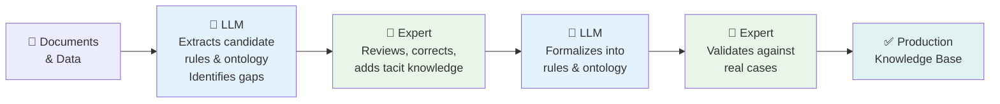

# Module 1.5 — The Knowledge Acquisition Bottleneck

---

## The Core Problem

!!! danger "KE's Greatest Challenge"
    The single biggest challenge in Knowledge Engineering is not the technology — it is getting the knowledge **OUT of expert heads** and **INTO the system**.

    This is called the **Knowledge Acquisition Bottleneck**.

```
┌─────────────────────┐                    ┌──────────────────────┐
│   EXPERT'S HEAD     │                    │    KNOWLEDGE BASE    │
│                     │                    │                      │
│  30 years of        │   ─── ??? ────►   │   Rules & Facts      │
│  experience         │                    │                      │
│  Intuition          │   ◄─── Hard ────   │                      │
│  Tacit patterns     │                    │                      │
│  "I just know"      │                    │                      │
└─────────────────────┘                    └──────────────────────┘
```

---

## The Bicycle Test

!!! example "Can You Explain How to Ride a Bicycle?"
    Imagine explaining bicycle riding **only in words** to someone who has never ridden one.

    You would say: *"Sit on the seat, pedal, and balance."*

    What you **cannot** explain:

    - The micro-adjustments your body makes 1,000 times per second
    - How you lean **into** a turn to maintain balance (counterintuitively)
    - How you sense the exact moment to brake based on surface feel
    - How you predict road texture from tiny visual cues

    All of that is **tacit knowledge**. Knowledge Engineering's hardest job is capturing exactly this.

---

## 5 Reasons the Bottleneck Exists

=== "1. Tacit Knowledge is Subconscious"
    Expert pattern recognition becomes automatic over years of practice.
    They cannot "see" their own reasoning process anymore.

    *"I've done this 10,000 times — I just know."*

=== "2. Experts Over-Simplify"
    Experts assume the Knowledge Engineer knows basics they don't.
    They skip steps that feel "obvious" to them.

    *"And then you just do the standard thing..."*
    ← What standard thing? This is where the KE must probe harder.

=== "3. Knowledge is Contextual"
    Expert rules rarely apply universally. They depend on subtle context.

    *"It depends on..."* is the most common expert answer.
    Capturing ALL relevant context is nearly impossible without the right techniques.

=== "4. Experts Disagree"
    Two cardiologists may diagnose the same patient differently.
    Two architects may recommend different cloud patterns for the same workload.

    Whose knowledge do you encode? How do you resolve genuine disagreement?

=== "5. Human Psychology"
    Some experts subtly resist knowledge capture — consciously or not.
    Fear of being replaced or devalued as an expert creates friction.

    Build trust. Position KE as preserving their legacy, not replacing them.

---

## Modern Solutions

=== "Think-Aloud Protocol"
    Ask the expert to **narrate their thinking in real time** as they solve a problem.

    *"I'm looking at this architecture diagram and I notice the database has no read replica..."*

    This captures **real-time reasoning**, not post-hoc explanation which is often sanitised and incomplete.

    **Best for:** Capturing procedural and tacit knowledge

=== "Case-Based Capture"
    Build a library of annotated historical cases.

    *"In this case, I recommended Service Bus because the volume was >10K msg/sec AND the consumers needed to be independently scalable."*

    Experts find it **easier to explain past decisions** than to articulate abstract rules.

    **Best for:** Building case-based reasoning systems and validating rules

=== "ML from Historical Data"
    Learn rules from the expert's **past decisions** rather than asking them to explain those decisions.

    Train decision trees on historical outcomes → extract readable rules → have expert validate.

    **Best for:** When large volumes of historical decisions exist

=== "LLMs as Knowledge Extractors"
    Use a large language model to **interview the expert** with intelligent follow-up questions, or to read domain documents and propose candidate rules for expert review.

    Expert **validates and corrects** rather than creating from scratch — dramatically reducing cognitive burden.

    **Best for:** Accelerating acquisition from documents and initial rule drafting

=== "Automated Rule Discovery"
    Extract rules directly from data using association rule mining or decision tree induction.

    Expert validates the discovered rules rather than writing them from scratch.

    **Best for:** Supplementing manual acquisition with data-driven patterns

---

## The Future: Human-AI Collaborative KE



!!! success "The Key Insight"
    AI handles the **mechanical work** of extraction and formalization.
    The expert handles **judgment, correction, and validation**.
    Together they produce a knowledge base in days rather than months.

---

## Handling Expert Disagreement

When two experts disagree, you have three options:

| Approach | When to Use |
|---|---|
| **Certainty factors** — encode both views with different confidence levels | When both views are valid in different contexts |
| **Context conditions** — encode both rules with different preconditions | When the disagreement depends on contextual factors |
| **Delphi method** — structured consensus-building across multiple experts | When you need a single canonical answer |

---

## Key Takeaways

- [x] The Knowledge Acquisition Bottleneck is **KE's greatest challenge** — not a technology problem
- [x] Tacit knowledge — the *"I just know"* expertise — is hardest to capture but most valuable
- [x] Experts struggle to explain their own intuition — **they need the right techniques**
- [x] Multiple experts disagreeing is normal — **conflict resolution is part of KE**
- [x] Modern solutions: think-aloud, case-based capture, ML from data, LLMs as extractors
- [x] The future of KE is **Human + AI collaboration**, not either alone

---

## Part 1 Complete

Congratulations — you have completed all 5 modules of Part 1: Foundations of Knowledge Engineering.

**Your next steps:**

[Take the Part 1 Assessment →](assessment.md){ .md-button .md-button--primary }
[Review the Labs →](labs.md){ .md-button }
[View Slide Outlines →](slides.md){ .md-button }
