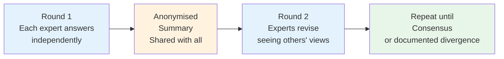

# Module 2.1 — Knowledge Elicitation Techniques

---

## Opening Hook

!!! quote "The Expert Knows More Than They Can Tell"
    You sit down with a 25-year veteran cloud architect. You ask:
    *"What makes a good microservices architecture?"*

    They say: *"It depends."*

    You ask: *"On what?"*

    They say: *"You just know it when you see it."*

    **Your job as a Knowledge Engineer is to make "you just know it" into something a machine can use.**

---

## What is Knowledge Elicitation?

> **Knowledge Elicitation** is the process of extracting expertise from domain experts through structured techniques — converting tacit, implicit knowledge into explicit, structured knowledge that can be encoded in a system.

It is the **first and most critical phase** of the Knowledge Acquisition lifecycle. Get this wrong and everything downstream is built on a faulty foundation.

---

## The Elicitation Toolkit

There are 6 core techniques, each suited to different situations:

```
┌─────────────────────────────────────────────────────────────────┐
│                  ELICITATION TECHNIQUES                        │
│                                                                 │
│  LOW STRUCTURE ◄────────────────────────────► HIGH STRUCTURE  │
│                                                                 │
│  Observation → Think-Aloud → Interview → Laddering →          │
│  Repertory Grid → Constrained Processing                       │
└─────────────────────────────────────────────────────────────────┘
```

---

## Technique 1 — Structured Interviews

**Best for:** Capturing explicit, declarative knowledge

**How it works:** The KE engineer asks the expert a prepared set of questions in a systematic way, moving from general to specific.

=== "Good Questions"
    - *"What are the key factors you consider when choosing a database?"*
    - *"Walk me through a typical [decision/diagnosis/recommendation]"*
    - *"What is the first thing you check when [problem] occurs?"*
    - *"What makes Case A different from Case B?"*

=== "Bad Questions"
    - *"What rules do you follow?"* — Too abstract, experts can't answer this
    - *"How do you do your job?"* — Too broad, produces vague answers
    - *"Is X important?"* — Yes/no questions yield no useful knowledge

=== "Interview Structure"
    ```
    Phase 1 (10 min) — Warm-up
      Build rapport, explain purpose, set expectations

    Phase 2 (30 min) — Broad exploration
      What does the expert do? What decisions do they make?

    Phase 3 (30 min) — Deep dive
      Focus on 2-3 specific decisions or scenarios

    Phase 4 (10 min) — Validation
      Read back what you captured. Did you get it right?
    ```

---

## Technique 2 — Think-Aloud Protocol

**Best for:** Capturing tacit, procedural knowledge — the "I just do it" expertise

**How it works:** The expert performs a real task while narrating their thought process aloud in real time. The KE engineer records and transcribes.

!!! success "Why This Works Better Than Interviews"
    Retrospective interviews capture what experts *think* they do.
    Think-aloud captures what they *actually* do.

    These are often surprisingly different.

**Example session:**

```
Task: "Review this cloud architecture diagram and tell me
      what you notice, what concerns you, what you'd change"

Expert: "Ok so I'm looking at this... first thing I check is
         the database layer... I see it's a single instance,
         no read replica — that's a red flag for me immediately
         because if load spikes the whole thing goes down...
         Now I'm looking at the API gateway... hmm, no rate
         limiting configured... that's another concern...
         The caching layer is here but it's positioned after
         the auth check which means every request hits auth
         even for cached responses — that's inefficient..."
```

**What the KE captures:**
```
Rule R1: IF database = single_instance AND load = variable
         THEN flag: no_read_replica (severity: HIGH)

Rule R2: IF api_gateway.rate_limiting = false
         THEN flag: no_rate_limiting (severity: MEDIUM)

Rule R3: IF cache_position = after_auth
         THEN flag: inefficient_cache_placement
```

---

## Technique 3 — Laddering

**Best for:** Understanding deep causal reasoning — the WHY behind decisions

**How it works:** Start with a decision and keep asking "Why?" and "How?" to drill deeper into the reasoning chain.

```
KE:     "You recommended Azure Service Bus. Why?"
Expert: "Because the system needs reliable async messaging."
KE:     "Why is reliable async messaging important here?"
Expert: "Because the consumers need to scale independently."
KE:     "Why do they need to scale independently?"
Expert: "Because message volume is unpredictable — it spikes
         10x during business hours."
KE:     "How do you know when Service Bus is NOT the right choice?"
Expert: "When latency is under 10ms and you need request-reply
         — then you want direct REST calls instead."
```

**What this produces:**

```
Rule R1:
IF   messaging_pattern = "async"
     AND consumer_scaling = "independent"
     AND volume_pattern = "spiky"
THEN recommend = "Azure Service Bus"

Rule R2 (the boundary condition — found by laddering):
IF   latency_requirement < 10ms
     AND pattern = "request-reply"
THEN recommend = "Direct REST" NOT "Service Bus"
```

!!! tip "Laddering reveals the edge cases"
    Always ask "When does this rule NOT apply?" — that surfaces the most valuable boundary conditions.

---

## Technique 4 — Repertory Grid

**Best for:** Surfacing hidden criteria experts use to distinguish between cases

**How it works:** Present the expert with sets of 3 cases (triads). Ask: "Two of these are similar and one is different. Which two? Why?"

**Example:**

```
Triad: [Case A: DynamoDB] [Case B: Cosmos DB] [Case C: PostgreSQL]

Expert: "A and B are similar — both NoSQL, globally distributed.
         C is different — relational, ACID transactions."

KE records bipolar construct:
  NoSQL, globally distributed  ←→  Relational, ACID

Triad: [Case A: Lambda] [Case B: Fargate] [Case C: EC2]

Expert: "A and B are similar — both managed compute, no server
         management. C is different — you manage the OS yourself."

KE records bipolar construct:
  Managed serverless  ←→  Self-managed infrastructure
```

**Result:** A grid of constructs that reveals the expert's full decision criteria — including ones they never mentioned in interviews.

---

## Technique 5 — Case-Based Elicitation

**Best for:** Capturing knowledge from past decisions — especially useful when experts struggle to articulate abstract rules

**How it works:** Present the expert with historical cases and ask them to annotate their reasoning.

```
"Here is an architecture you designed 6 months ago.
 Looking at it now:
 - Why did you choose this pattern?
 - What alternatives did you consider?
 - What would you do differently today?
 - What were the key constraints that drove this decision?"
```

**Why it works:** Experts find it far easier to reason about specific concrete cases than to generate abstract rules from scratch.

---

## Technique 6 — Observation & Shadowing

**Best for:** Capturing highly tacit knowledge that experts cannot articulate even with prompting

**How it works:** The KE engineer silently observes the expert performing their actual work over several sessions, noting patterns, triggers, and decisions.

```
Day 1: Observe expert reviewing 3 architecture proposals
       Note: What do they look at first? What questions do they ask?

Day 2: Observe expert in client meeting
       Note: What concerns do they raise? What reassures them?

Day 3: Pattern analysis
       Note: What patterns appear across multiple observations?
```

**Best combined with:** Think-aloud after observation — "I noticed you always check X first. Why is that?"

---

## Choosing the Right Technique

| Situation | Best Technique |
|---|---|
| Expert can articulate rules clearly | Structured Interview |
| Expert "just does it" automatically | Think-Aloud Protocol |
| Need to understand causal reasoning | Laddering |
| Expert can't describe criteria they use | Repertory Grid |
| Large archive of past decisions exists | Case-Based Elicitation |
| Knowledge is deeply tacit, embodied | Observation + Shadowing |
| Multiple experts, need consensus | Delphi Method |

---

## The Delphi Method — Multi-Expert Consensus

When you have **multiple experts who disagree**, use the Delphi Method:



**Key rule:** Responses are anonymous until consensus forms. This prevents senior experts from dominating junior ones.

---

## Common Elicitation Mistakes

| Mistake | Why It Fails | Fix |
|---|---|---|
| Asking abstract questions | Experts can't answer "what rules do you use?" | Ask about specific past cases |
| One interview only | First session captures surface knowledge | Plan minimum 3 sessions per expert |
| Not probing "it depends" | Leaves the most important conditions uncaptured | Always ask "depends on what exactly?" |
| Accepting vague answers | "Good judgment" is not a rule | Keep asking "how would I know?" |
| Not validating back | KE misunderstands and expert never corrects it | Read back summaries at end of each session |
| Single expert only | One expert's bias becomes the system's bias | Always use minimum 2-3 experts |

---

## Key Takeaways

- [x] No single elicitation technique works for all situations — **match technique to knowledge type**
- [x] Think-aloud captures what experts **actually do**, not what they think they do
- [x] Laddering reveals **edge cases and boundary conditions** — the most valuable knowledge
- [x] Repertory Grid surfaces **hidden criteria** experts never mention in interviews
- [x] Always validate: read back what you captured and let the expert correct it
- [x] Plan for **multiple sessions** — deep knowledge rarely surfaces in one sitting

---

## What's Next

[Module 2.2 — Document & Text Mining →](module-2-2.md){ .md-button .md-button--primary }

---

*Hands-on practice? → [Lab 2.1](labs.md#lab-21)*
*Slide outline? → [Module 2.1 Slides](slides.md#module-21-slide-outline)*
*Quiz? → [Module 2.1 Quiz](assessment.md#module-21-quiz)*
