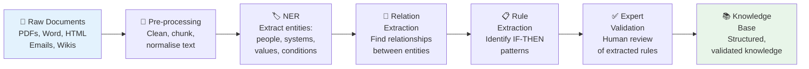

# Module 2.2 — Document & Text Mining

---

## Why Documents Are a Gold Mine

!!! info "The Untapped Knowledge Source"
    Most organisations have decades of expertise locked in:

    - Technical documentation and SOPs
    - Past project reports and post-mortems
    - Regulatory guidelines and compliance manuals
    - Email threads and meeting notes
    - Incident reports and runbooks

    **Document mining extracts structured knowledge from these sources automatically — without requiring expert time.**

---

## What is Document & Text Mining for KE?

> **Document Mining** is the process of extracting structured knowledge — facts, rules, relationships, and constraints — from unstructured text sources using NLP and pattern recognition techniques.

```
Unstructured Text                    Structured Knowledge
─────────────────                    ────────────────────
"If the CPU utilisation             IF cpu_utilisation > 85%
 exceeds 85% for more               AND duration > 5_minutes
 than 5 minutes, the                THEN trigger = scale_out
 auto-scaler should                 CONFIDENCE = 0.95
 trigger a scale-out"
          │                                   ▲
          └──── NLP Pipeline ────────────────┘
```

---

## The Document Mining Pipeline



---

## Step 1 — Pre-processing

Before extracting knowledge, documents must be cleaned and prepared:

| Task | What It Does | Example |
|---|---|---|
| **Text extraction** | Convert PDF/Word to plain text | `pdfplumber`, `python-docx` |
| **Sentence splitting** | Break into individual sentences | spaCy sentence segmentation |
| **Normalisation** | Lowercase, remove noise, fix encoding | Remove headers, page numbers |
| **Chunking** | Split into meaningful segments | By section, paragraph, or topic |

```python
import pdfplumber
import spacy

# Extract text from PDF
with pdfplumber.open("architecture_guidelines.pdf") as pdf:
    text = " ".join(page.extract_text() for page in pdf.pages)

# Split into sentences
nlp = spacy.load("en_core_web_sm")
doc = nlp(text)
sentences = [sent.text for sent in doc.sents]
```

---

## Step 2 — Named Entity Recognition (NER)

**NER identifies and classifies key terms** in the text — the building blocks of knowledge rules.

=== "Standard NER Entities"
    | Entity Type | Example |
    |---|---|
    | TECHNOLOGY | "Azure Service Bus", "Lambda", "DynamoDB" |
    | METRIC | "CPU utilisation", "response time", "error rate" |
    | THRESHOLD | "85%", "200ms", "10,000 messages/sec" |
    | CONDITION | "if", "when", "exceeds", "falls below" |
    | ACTION | "recommend", "trigger", "avoid", "use" |

=== "Custom NER for Your Domain"
    Standard NER models don't know your domain-specific terms. Train a custom NER model:

    ```python
    # Using spaCy to train custom NER
    # Label your domain entities:
    training_data = [
        ("Use Cosmos DB for globally distributed workloads",
         {"entities": [(4, 12, "SERVICE"),
                       (17, 38, "USE_CASE")]}),
        ("If latency exceeds 200ms trigger an alert",
         {"entities": [(3, 10, "METRIC"),
                       (19, 24, "THRESHOLD"),
                       (25, 32, "ACTION")]})
    ]
    ```

---

## Step 3 — Relation Extraction

Once entities are identified, extract the **relationships between them**:

```
Text: "DynamoDB provides single-digit millisecond latency
       for key-value workloads at any scale"

Entities found:
  [DynamoDB] → SERVICE
  [single-digit millisecond] → PERFORMANCE
  [key-value workloads] → USE_CASE
  [any scale] → SCALABILITY

Relations extracted:
  DynamoDB --PROVIDES--> single-digit millisecond latency
  DynamoDB --SUITED_FOR--> key-value workloads
  DynamoDB --SCALES_TO--> any scale
```

This feeds directly into a **Knowledge Graph** (covered in Part 3).

---

## Step 4 — Rule Extraction

The most valuable output: identifying IF-THEN patterns in text.

**Pattern-based extraction** looks for linguistic markers:

| Linguistic Marker | Maps To |
|---|---|
| "if... then...", "when... use..." | IF-THEN rule |
| "always", "must", "required" | Hard constraint |
| "should", "recommended", "prefer" | Soft rule (CF < 1.0) |
| "avoid", "never", "do not" | Negative rule |
| "depends on", "except when" | Conditional modifier |

**Example extraction:**

```
Text: "You should always use a read replica when the
       database receives more than 1000 read requests
       per second to avoid performance degradation"

Extracted rule:
IF   read_requests_per_second > 1000
THEN use_read_replica = TRUE
     confidence = 0.90    ← "should always" → high but not absolute
     reason = "avoid performance degradation"
```

---

## Step 5 — Expert Validation

!!! warning "Never Skip This Step"
    Document mining produces **candidate knowledge** — not validated knowledge.

    Documents may be:
    - Outdated (written 3 years ago, tech has changed)
    - Incorrect (contained errors when written)
    - Incomplete (missing important context)
    - Ambiguous (different readers interpret differently)

**Validation workflow:**

```
KE System extracts 50 candidate rules from documents
         │
         ▼
Expert reviews each rule: ✓ Correct  ✗ Wrong  ~ Needs modification
         │
         ▼
~70% accepted as-is  ~20% modified  ~10% rejected
         │
         ▼
Validated rules enter the Knowledge Base
```

---

## Tools for Document Mining

| Tool | Best For | Language |
|---|---|---|
| **spaCy** | NER, relation extraction, custom models | Python |
| **Hugging Face Transformers** | BERT-based NER, semantic extraction | Python |
| **Apache OpenNLP** | Java-based NLP pipeline | Java |
| **Azure Text Analytics** | Cloud NER, key phrase extraction | REST API |
| **AWS Comprehend** | Cloud NER, entity recognition | REST API |
| **LangChain** | LLM-powered document Q&A and extraction | Python |

---

## Real-World Example: Mining an Architecture Runbook

**Input document:** 45-page cloud architecture runbook

**Extracted output:**

```
From: "When traffic exceeds 10,000 requests/minute,
       the load balancer should trigger auto-scaling"

Rule R_AS_01:
IF   traffic > 10000_rpm
THEN action = trigger_autoscaling
     confidence = 0.95

From: "Never deploy directly to production without
       running the integration test suite"

Rule R_DEPLOY_01:
IF   target_environment = "production"
THEN prerequisite = integration_tests_passed
     type = HARD_CONSTRAINT
     confidence = 1.0

From: "Prefer Azure Cosmos DB over DynamoDB for
       multi-region active-active write requirements"

Rule R_DB_01:
IF   write_pattern = "multi-region-active-active"
THEN prefer = "Azure Cosmos DB"
     over = "DynamoDB"
     confidence = 0.85
```

**50 pages → 127 candidate rules → 94 validated → loaded into KB**

---

## Key Takeaways

- [x] Documents are an **untapped gold mine** of structured knowledge
- [x] The pipeline is: Pre-process → NER → Relations → Rules → Validate
- [x] **Always validate** extracted rules with domain experts — documents can be stale
- [x] Linguistic markers (`if`, `should`, `must`, `never`) map directly to rule types
- [x] Cloud NLP services (Azure Text Analytics, AWS Comprehend) make this accessible **without ML expertise**
- [x] Document mining complements — it does not replace — expert interviews

---

## What's Next

[Module 2.3 — ML for Knowledge Acquisition →](module-2-3.md){ .md-button .md-button--primary }

---

*Hands-on practice? → [Lab 2.2](labs.md#lab-22)*
*Quiz? → [Module 2.2 Quiz](assessment.md#module-22-quiz)*
