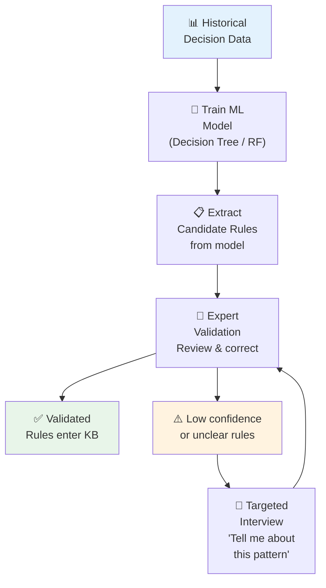

# Module 2.3 — ML for Knowledge Acquisition

---

## The Idea: Learn Rules From Data

!!! info "Key Insight"
    Instead of asking experts to explain their decisions, what if you could **learn the rules from the decisions they already made**?

    If an expert has made 10,000 loan decisions, 5,000 architecture recommendations, or 2,000 diagnoses — the rules they follow are hidden in that data. Machine Learning can surface them.

---

## When to Use ML for Knowledge Acquisition

| Use ML When | Avoid ML When |
|---|---|
| Large historical decision dataset exists | No historical data available |
| Expert struggles to articulate rules | Expert can clearly explain their reasoning |
| Rules are complex with many variables | Simple, well-understood rule space |
| Pattern is consistent across decisions | Expert behaviour is inconsistent or evolving |
| Speed of acquisition matters | Explainability of rules is critical |

---

## Technique 1 — Decision Tree Induction

**The most KE-friendly ML technique** — produces rules that humans can read and validate.

**How it works:** Train a decision tree on historical expert decisions. The tree structure becomes your rule set.

=== "The Data"
    ```
    Historical architecture decisions:
    ┌──────────────┬──────────┬───────────┬──────────────┐
    │ Workload     │ Volume   │ Latency   │ Expert chose │
    ├──────────────┼──────────┼───────────┼──────────────┤
    │ event-driven │ high     │ async     │ Service Bus  │
    │ request-reply│ medium   │ < 100ms   │ REST API     │
    │ batch        │ very high│ async     │ Storage Queue│
    │ event-driven │ low      │ async     │ Event Grid   │
    │ request-reply│ high     │ < 10ms    │ gRPC         │
    └──────────────┴──────────┴───────────┴──────────────┘
    ```

=== "The Tree"
    ```
    Is workload event-driven?
    ├── YES → Is volume high?
    │         ├── YES → Service Bus ✓
    │         └── NO  → Event Grid ✓
    └── NO  → Is latency < 10ms?
              ├── YES → gRPC ✓
              └── NO  → Is volume high?
                        ├── YES → REST API (with caching) ✓
                        └── NO  → REST API ✓
    ```

=== "Extracted Rules"
    ```python
    from sklearn.tree import DecisionTreeClassifier, export_text

    # Train on historical decisions
    model = DecisionTreeClassifier(max_depth=4, min_samples_leaf=5)
    model.fit(X_train, y_train)

    # Extract human-readable rules
    rules = export_text(model, feature_names=feature_names)
    print(rules)

    # Output becomes candidate rules for expert validation
    ```

---

## Technique 2 — Association Rule Mining

**Best for:** Discovering co-occurrence patterns — "when A happens, B usually follows"

**How it works:** Find frequent patterns in historical data using algorithms like Apriori or FP-Growth.

**Example — IT Incident Analysis:**

```
Mining 5,000 incident reports for patterns:

Found: {high_cpu, memory_leak} → {restart_service}
       Support: 65%  Confidence: 89%

Extracted rule:
IF   cpu_utilisation > 90%
     AND memory_usage_growing = true
THEN remediation = restart_service
     confidence = 0.89

Found: {failed_health_check, timeout_errors} → {scale_out}
       Support: 71%  Confidence: 94%

Extracted rule:
IF   health_check_failing = true
     AND timeout_rate > 5%
THEN remediation = scale_out
     confidence = 0.94
```

**Key terms:**

| Term | Meaning | Good Value |
|---|---|---|
| **Support** | How often this pattern appears in the data | > 5% |
| **Confidence** | How often the rule is correct when conditions are met | > 80% |
| **Lift** | How much better than random chance | > 1.0 |

---

## Technique 3 — Random Forest Rule Extraction

**Best for:** High-accuracy rule extraction when data is complex and noisy

**How it works:** Train a Random Forest, then extract the most important features and decision paths.

```python
from sklearn.ensemble import RandomForestClassifier
import pandas as pd

# Train Random Forest on expert decisions
rf = RandomForestClassifier(n_estimators=100, random_state=42)
rf.fit(X_train, y_train)

# Extract feature importance — what does the expert consider most?
importance = pd.Series(rf.feature_importances_,
                       index=feature_names).sort_values(ascending=False)

print("Top factors in expert decisions:")
print(importance.head(10))

# Output example:
# workload_type        0.32   ← Most important factor
# volume_per_second    0.24
# latency_requirement  0.18
# consistency_needed   0.12
# ...
```

**Use feature importance to focus your interviews:**
"The model shows workload_type and volume are the top factors in your decisions. Can you explain exactly how these drive your recommendations?"

---

## The ML-to-Rules Pipeline



---

## Limitations — Why ML Alone Is Not Enough

| Limitation | Impact | Solution |
|---|---|---|
| **Black box models** (neural nets) produce unreadable rules | Rules can't be validated | Use Decision Trees or Rule Extraction |
| **Historical bias** — model learns past mistakes too | Bad rules enter KB | Expert validation is mandatory |
| **Data sparsity** for rare cases | Rules missing for edge cases | Supplement with expert interviews |
| **No causal understanding** — only correlation | Rules may be spurious | Expert validates causal logic |
| **Concept drift** — expert behaviour evolves | Old rules become stale | Retrain periodically |

!!! warning "ML is an Accelerator, Not a Replacement"
    ML from historical data accelerates acquisition dramatically — but the expert must always validate. A rule that appears in the data may be a past mistake, an exception, or a correlation without causation.

---

## Key Takeaways

- [x] ML can **learn rules from historical expert decisions** — without requiring the expert to articulate them
- [x] **Decision Trees** are the most KE-friendly ML technique — they produce readable, validatable rules
- [x] **Association Rule Mining** surfaces co-occurrence patterns from event logs and incident data
- [x] **Feature importance** tells you what factors experts actually weigh — use this to focus interviews
- [x] ML is an **accelerator** — expert validation is always required
- [x] Combine ML acquisition with interview elicitation for maximum coverage

---

## What's Next

[Module 2.4 — Knowledge Acquisition from LLMs →](module-2-4.md){ .md-button .md-button--primary }

---

*Hands-on practice? → [Lab 2.3](labs.md#lab-23)*
*Quiz? → [Module 2.3 Quiz](assessment.md#module-23-quiz)*
