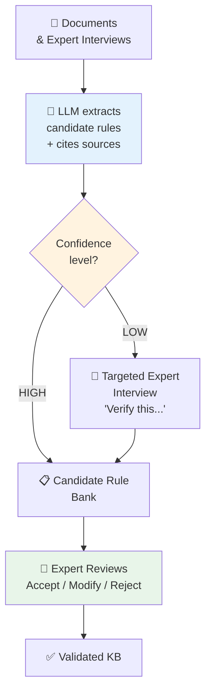

# Module 2.4 — Knowledge Acquisition from LLMs

---

## The Game Changer

!!! success "How LLMs Transform Knowledge Acquisition"
    Before LLMs, knowledge acquisition was bottlenecked by expert time.
    Each rule required an interview session, careful questioning, and manual transcription.

    LLMs change this in three ways:

    1. **Read and extract** from documents 100x faster than humans
    2. **Ask smart follow-up questions** that a junior KE engineer would miss
    3. **Draft candidate rules** for experts to validate — not create from scratch

    The expert's time is now spent on **judgment and validation**, not transcription.

---

## Four Ways LLMs Accelerate Knowledge Acquisition

---

### Method 1 — Document Extraction with LLMs

Feed documents to an LLM and prompt it to extract structured knowledge.

**Prompt template:**

```
You are a Knowledge Engineer extracting rules from technical documentation.

Read the following document excerpt and extract:
1. All IF-THEN rules (explicit or implied)
2. All constraints and requirements
3. All best practice recommendations
4. Any threshold values or conditions mentioned

Format each extracted item as:
Rule ID: R[n]
Type: [HARD_RULE / SOFT_RULE / BEST_PRACTICE / CONSTRAINT]
IF: [conditions]
THEN: [conclusion or action]
Source: [quote the original sentence]
Confidence: [HIGH / MEDIUM / LOW based on how explicit it is]

Document excerpt:
[PASTE DOCUMENT TEXT HERE]
```

**Example output:**

```
Rule ID: R1
Type: SOFT_RULE
IF: workload requires global distribution AND write latency is critical
THEN: prefer Azure Cosmos DB over standard SQL databases
Source: "For globally distributed applications requiring low write
         latency, Cosmos DB's multi-master replication is preferred"
Confidence: HIGH

Rule ID: R2
Type: HARD_RULE
IF: data contains PII AND region = EU
THEN: storage must remain within EU boundaries
Source: "All PII data for EU customers must be stored within
         EU data centres to comply with GDPR"
Confidence: HIGH
```

---

### Method 2 — LLM as Intelligent Interviewer

Use an LLM to conduct or assist knowledge elicitation interviews — asking follow-up questions a junior KE engineer would miss.

**System prompt for interview assistant:**

```
You are an expert Knowledge Engineer helping to elicit domain
knowledge from a {DOMAIN} expert. Your goal is to extract
precise, structured IF-THEN rules from their expertise.

Rules for questioning:
- Always follow vague answers with "Can you give me a specific example?"
- When the expert says "it depends", always ask "Depends on what exactly?"
- After each answer, probe for the exception: "When would this NOT apply?"
- Keep asking "Why?" until you reach a concrete, actionable condition
- When you have enough for a rule, propose it and ask the expert to confirm

The expert's domain is: {DOMAIN}
Current topic: {TOPIC}
```

**Example interaction:**

```
LLM:    "You mentioned you prefer microservices for large teams.
         At what team size does this become relevant?"

Expert: "Probably when you have more than 5-6 developers working
         on the same codebase."

LLM:    "So the rule would be: IF team_size > 6 AND same_codebase
         THEN consider_microservices. Is that accurate?"

Expert: "Yes, but only if the domains are also clearly separable."

LLM:    "Good — so: IF team_size > 6 AND same_codebase
         AND domain_separation = clear THEN recommend_microservices.
         And when would you NOT recommend microservices even with
         a large team?"
```

---

### Method 3 — Knowledge Gap Identification

Use an LLM to analyse your existing knowledge base and identify what is missing.

**Prompt template:**

```
Here is our current Knowledge Base for {DOMAIN}:

[LIST OF EXISTING RULES]

Analyse this knowledge base and identify:
1. Gaps — what scenarios are not covered?
2. Conflicts — any rules that might contradict each other?
3. Missing edge cases — what boundary conditions are not addressed?
4. Questions to ask the domain expert to fill these gaps

Focus on: {SPECIFIC_SUBDOMAIN}
```

**Example output:**

```
GAPS IDENTIFIED:
1. No rules covering disaster recovery scenarios
2. Missing: what to do when BOTH latency AND cost are critical
3. No coverage of hybrid cloud (Azure + AWS) architecture patterns

POTENTIAL CONFLICTS:
1. Rule R12 says "prefer serverless for event-driven" but
   Rule R27 says "avoid serverless for long-running tasks" —
   need clarification on what counts as "long-running"

SUGGESTED INTERVIEW QUESTIONS:
1. "Walk me through your approach when a client needs both
    sub-100ms latency AND minimal cost — how do you prioritise?"
2. "Have you designed any hybrid Azure/AWS architectures?
    What drove that decision?"
```

---

### Method 4 — Rule Formalisation

Expert gives informal knowledge → LLM converts to formal rule syntax → Expert validates.

**Input (informal expert statement):**
```
"When we're building for healthcare clients, we basically
 always go with Azure because of the compliance certifications,
 especially if they're in the US and need HIPAA. But if they
 already have an AWS setup and are just adding a new module,
 we stay on AWS to avoid migration complexity."
```

**Prompt:**
```
Convert this expert statement into structured IF-THEN rules.
Use this format:
Rule ID, Type, IF [conditions], THEN [recommendation], Confidence, Notes
```

**LLM output (for expert review):**
```
Rule R_HC_01:
Type: STRONG_PREFERENCE
IF   client_domain = "healthcare"
     AND region = "US"
     AND existing_cloud = "none"
THEN recommend = "Azure"
     reason = "HIPAA compliance certifications"
     confidence = 0.90

Rule R_HC_02:
Type: OVERRIDE
IF   client_domain = "healthcare"
     AND existing_cloud = "AWS"
     AND change_type = "additive_module"
THEN recommend = "AWS"
     reason = "avoid migration complexity"
     confidence = 0.85
     overrides = "R_HC_01"
```

---

## Managing the Risks

LLMs are powerful acquisition tools but introduce specific risks:

=== "Hallucination"
    **Risk:** LLM invents plausible-sounding but incorrect rules.

    **Mitigation:**
    - Always require the LLM to cite the source sentence
    - If it cannot cite a source, flag as "unverified — requires expert confirmation"
    - Never let LLM-extracted rules enter the KB without expert sign-off

=== "Outdated Knowledge"
    **Risk:** LLM training data may be 1-2 years old — newer services or best practices missing.

    **Mitigation:**
    - Explicitly tell experts: "The AI suggested this rule. Is it still current?"
    - Focus LLM on extraction from your own documents, not general knowledge

=== "Confident but Wrong"
    **Risk:** LLMs state incorrect things confidently, without expressing uncertainty.

    **Mitigation:**
    - Always ask the LLM to rate its own confidence AND explain why
    - Low-confidence items go directly to expert interview, not candidate rule bank

=== "Bias Amplification"
    **Risk:** If training documents contain biased practices, the LLM extracts biased rules.

    **Mitigation:**
    - Use multiple document sources
    - Expert validation is the final filter

---

## LLM Acquisition Workflow



---

## Key Takeaways

- [x] LLMs **dramatically accelerate** knowledge acquisition — especially from documents
- [x] Four key methods: Document Extraction, Intelligent Interviewer, Gap Identification, Rule Formalisation
- [x] **Always require source citations** — if it can't cite it, flag it as unverified
- [x] LLMs produce **candidate rules**, not validated rules — expert sign-off is mandatory
- [x] LLMs are best at reducing the **mechanical burden** on experts, not replacing expert judgment
- [x] Combine LLM extraction with human elicitation for a complete acquisition pipeline

---

## What's Next

[Module 2.5 — Human-AI Collaborative Acquisition →](module-2-5.md){ .md-button .md-button--primary }

---

*Hands-on practice? → [Lab 2.4](labs.md#lab-24)*
*Quiz? → [Module 2.4 Quiz](assessment.md#module-24-quiz)*
