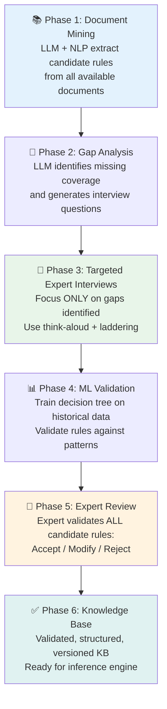

# Module 2.5 — Human-AI Collaborative Acquisition

---

## The Complete Picture

!!! success "Bringing It All Together"
    Parts 2.1–2.4 covered individual acquisition techniques.
    This module shows how to **combine them into a single end-to-end pipeline** that maximises knowledge coverage while minimising expert time.

---

## The Problem with Single-Technique Approaches

| Technique Alone | What It Misses |
|---|---|
| Interviews only | Too slow, expert fatigue limits depth |
| Documents only | Outdated content, tacit knowledge absent |
| ML only | Edge cases, causal reasoning, novel situations |
| LLMs only | Hallucination risk, lacks domain-specific context |

**The solution:** A **layered pipeline** where each technique covers the gaps of the others.

---

## The Human-AI Collaborative Acquisition Pipeline



---

## Phase 1 — Document Mining (Days 1–3)

**Goal:** Extract all explicit knowledge from existing sources before any expert time is used.

**Activities:**
- Collect all relevant documents: SOPs, runbooks, guidelines, past reports
- Run LLM extraction pipeline on all documents
- Run NLP rule extraction (Module 2.2 techniques)
- Build initial candidate rule bank

**Output:** ~60–80% of explicit rules captured without any expert involvement

**Expert time required:** Zero at this stage

---

## Phase 2 — Gap Analysis (Day 4)

**Goal:** Identify what is missing from the document-extracted rules.

**Activities:**
- Feed candidate rule bank to LLM
- Ask LLM: "What scenarios are not covered? What conflicts exist?"
- Generate targeted interview question list

**Example gap analysis output:**
```
COVERAGE GAPS:
✗ No rules for disaster recovery scenarios
✗ No rules for cost-optimisation trade-offs
✗ No rules for hybrid cloud architectures

CONFLICTS FOUND:
! R12 and R27 may contradict — need expert clarification

INTERVIEW QUESTIONS GENERATED:
1. "Walk me through your DR approach for a mission-critical system"
2. "How do you decide between performance and cost when both matter?"
3. "Have you designed hybrid Azure/AWS systems? What drove that?"
```

**Expert time required:** 30 minutes to review gap analysis

---

## Phase 3 — Targeted Expert Interviews (Days 5–7)

**Goal:** Fill ONLY the gaps — not repeat what documents already captured.

**This is the key efficiency gain:** Expert sessions focus exclusively on:
- Knowledge gaps identified in Phase 2
- Tacit knowledge that documents cannot contain
- Conflict resolution between contradictory rules
- Edge cases and boundary conditions

**Techniques used:** Think-aloud, Laddering, Case-based (Modules 2.1)

**Expert time required:** 3–4 hours total (vs 20–30 hours without the pipeline)

---

## Phase 4 — ML Validation (Day 8)

**Goal:** Cross-validate extracted rules against historical decision data.

**Activities:**
- Train a decision tree on historical expert decisions
- Compare extracted rules against learned patterns
- Flag discrepancies: "Rule R14 says X but historical data shows Y in 30% of cases"
- Surface rules that appear in data but weren't in documents or interviews

**Output:** Discrepancy report for expert review

---

## Phase 5 — Expert Review (Days 9–10)

**Goal:** Expert validates the complete candidate rule bank.

**Review categories:**

| Decision | Action |
|---|---|
| ✅ **Accept** | Rule is correct as stated — add to KB |
| ✏️ **Modify** | Rule is correct concept, wrong details — expert corrects |
| ❌ **Reject** | Rule is wrong, outdated, or hallucinated — discard |
| ❓ **Defer** | Needs more investigation — flag for next round |

**Typical outcomes:**
```
Total candidate rules:    150
├── Accepted as-is:        95  (63%)
├── Modified by expert:    35  (23%)
├── Rejected:              12   (8%)
└── Deferred:               8   (5%)

Final validated rules:    130
```

---

## Handling Expert Disagreement

When two experts produce contradicting rules:

=== "Option 1 — Certainty Factors"
    Encode both rules with different confidence levels:

    ```
    Rule R_DB_01a (Expert A):
    IF   workload = "financial" THEN use = "PostgreSQL" CF = 0.80

    Rule R_DB_01b (Expert B):
    IF   workload = "financial" THEN use = "PostgreSQL" CF = 0.65
    OR   use = "DynamoDB" CF = 0.55
    ```

=== "Option 2 — Context Conditions"
    Discover that the disagreement is context-dependent:

    ```
    Rule R_DB_02 (resolved):
    IF   workload = "financial"
         AND transaction_volume = "high"
         AND ACID_required = true
    THEN use = "PostgreSQL"   (Expert A was right in this context)

    Rule R_DB_03 (resolved):
    IF   workload = "financial"
         AND read_heavy = true
         AND global_scale = true
    THEN use = "DynamoDB"   (Expert B was right in this context)
    ```

=== "Option 3 — Delphi Consensus"
    Use structured rounds of anonymous expert review until consensus is reached or the disagreement is formally documented as context-dependent.

---

## Knowledge Acquisition Plan Template

Use this template to plan any KE acquisition project:

```
KNOWLEDGE ACQUISITION PLAN
===========================

Project: [System Name]
Domain:  [Domain]
Experts: [Names and roles]

PHASE 1 — Document Mining
  Documents to process: [List]
  Expected rules:       [Estimate]
  Timeline:             [Days]

PHASE 2 — Gap Analysis
  Expert review time:   [Hours]
  Key gaps expected:    [List known gaps]

PHASE 3 — Expert Interviews
  Sessions planned:     [Number]
  Techniques:           [Think-aloud / Laddering / Cases]
  Topics to cover:      [From gap analysis]

PHASE 4 — ML Validation
  Historical data:      [Source and volume]
  Model type:           [Decision Tree / Association Rules]

PHASE 5 — Expert Review
  Review sessions:      [Number]
  Validation criteria:  [How will rules be approved]

TOTAL EXPERT TIME:      [Hours]
TOTAL TIMELINE:         [Days/Weeks]
TARGET KB SIZE:         [Number of rules]
```

---

## Key Takeaways

- [x] No single technique covers all knowledge — **combine them in a pipeline**
- [x] Document mining first: extract explicit knowledge before using expert time
- [x] Use gap analysis to **focus expert sessions** on what's truly missing
- [x] ML validation **cross-checks** extracted rules against historical behaviour
- [x] Expert validation is the **final quality gate** — never skip it
- [x] The pipeline reduces expert time from 20–30 hours to 3–4 hours while improving coverage

---

## Part 2 Complete

You have now mastered the full Knowledge Acquisition toolkit:

| Module | Technique | Best For |
|---|---|---|
| 2.1 | Elicitation Techniques | Tacit & explicit knowledge from experts |
| 2.2 | Document Mining | Explicit knowledge from text sources |
| 2.3 | ML Acquisition | Rules hidden in historical decision data |
| 2.4 | LLM Acquisition | Fast extraction + intelligent interviewing |
| 2.5 | Collaborative Pipeline | End-to-end acquisition at scale |

[Take the Part 2 Assessment →](assessment.md){ .md-button .md-button--primary }
[View Part 2 Labs →](labs.md){ .md-button }
